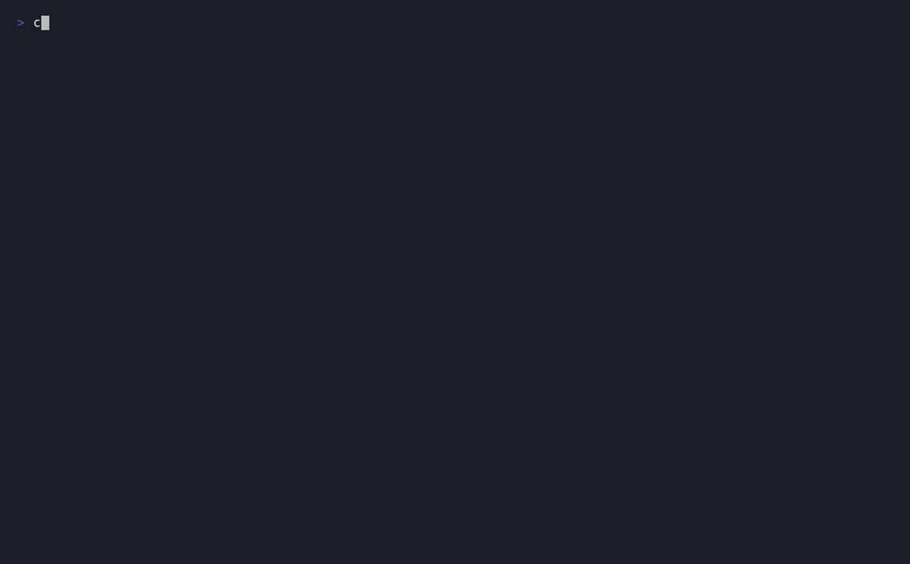

# Demos

Four terminal recordings of Paladin's core orchestration patterns, each generated from a
checked-in [VHS](https://github.com/charmbracelet/vhs) `.tape` script sitting beside it under
[`assets/recordings/`](assets/recordings/). Nothing here is hand-performed: every `.gif` and
`.cast` is produced by running the same real command — `cargo run --example <name>` against a
shipped example — and playing it back, never by editing frames or re-typing output by hand.

All four run **fully offline, with no API key**: two examples use `MockLlmAdapter`, and the other
two wire an inline mock `PaladinPort` implementation directly. Nothing here talks to a real LLM
provider.

The committed artifacts were produced with `vhs` `0.11.0`, `ttyd` `1.7.7`, `ffmpeg`
`5.1.9-0+deb12u1`, and `asciinema` `2.2.0` — the same toolchain versions recorded in
[`16-DOCS-04-TOOLCHAIN.md`](../.planning/phases/16-documentation-currency-the-architecture-gap/16-DOCS-04-TOOLCHAIN.md).

> **Note on this page's placement.** `docs/DEMOS.md` lives outside `docs/src/` and is
> deliberately **not** listed in [`docs/src/SUMMARY.md`](src/SUMMARY.md) — it is not part of the
> mdBook. FR-26.4's original README-embedding clause targeted a README that Milestone 11 Epic 5
> later rewrote into a concise landing page with no demos section, so the demos are indexed here
> instead and the README carries a single pointer to this page.

---

## 1. Basic Paladin Execution

Builds a single `Paladin` with the fluent `PaladinBuilder`, executes it against a mock LLM
response, and formats the result with the Markdown `Herald` — the smallest possible
end-to-end Paladin run.



- **Source:** [`examples/basic_paladin.rs`](../examples/basic_paladin.rs)
- **Text recording:** [`basic-paladin.cast`](assets/recordings/basic-paladin.cast)
- **Regenerate:**
  ```bash
  vhs docs/assets/recordings/basic-paladin.tape
  asciinema rec -c "cargo run --example basic_paladin" docs/assets/recordings/basic-paladin.cast
  ```

## 2. Battalion Formation

Runs three `Formation` pipelines — sequential Paladin execution where each Paladin's output
becomes the next Paladin's input — covering a research→analysis→summary chain, a formation with
shared context, and a `ContinueOnError` resilience strategy.


- **Source:** [`examples/formation_sequential.rs`](../examples/formation_sequential.rs)
- **Text recording:** [`battalion-formation.cast`](assets/recordings/battalion-formation.cast)
- **Regenerate:**
  ```bash
  vhs docs/assets/recordings/battalion-formation.tape
  asciinema rec -c "cargo run --example formation_sequential" docs/assets/recordings/battalion-formation.cast
  ```

## 3. Council Discussion

Convenes a `Council` of three expert Paladins (security, legal, technical) discussing whether to
implement two-factor authentication, using round-robin turn-taking and a max-rounds termination
condition, and prints the full discussion transcript.


- **Source:** [`examples/council_discussion.rs`](../examples/council_discussion.rs)
- **Text recording:** [`council-discussion.cast`](assets/recordings/council-discussion.cast)
- **Regenerate:**
  ```bash
  vhs docs/assets/recordings/council-discussion.tape
  asciinema rec -c "cargo run --example council_discussion" docs/assets/recordings/council-discussion.cast
  ```

## 4. Grove Routing

Builds a `Grove` of two specialist trees (security experts, performance experts) and routes five
example tasks to the right tree and agent using keyword-match routing, with a fallback tree for
ambiguous input.


- **Source:** [`examples/grove_routing.rs`](../examples/grove_routing.rs)
- **Text recording:** [`grove-routing.cast`](assets/recordings/grove-routing.cast)
- **Regenerate:**
  ```bash
  vhs docs/assets/recordings/grove-routing.tape
  asciinema rec -c "cargo run --example grove_routing" docs/assets/recordings/grove-routing.cast
  ```

---

## Regenerating a demo

Each demo above lists its own exact regeneration commands next to it, so regenerating any single
demo is a documented one-liner rather than an unwritten ritual. All four commands assume a
working directory at the repository root and require `vhs`, `ttyd`, `ffmpeg`, and `asciinema` on
`PATH`.

**Tool prerequisites:** `vhs` (which pulls in `ttyd` and `ffmpeg` as its own runtime dependencies)
and `asciinema` (which produces the `.cast` recording VHS cannot emit — VHS's `Output` directive
supports only `.gif`, `.mp4`, `.webm`, and PNG-frame directories). Both devcontainer images
(`.devcontainer/Dockerfile.dev` and `.devcontainer/Dockerfile`) provision all four tools; see
[`16-DOCS-04-TOOLCHAIN.md`](../.planning/phases/16-documentation-currency-the-architecture-gap/16-DOCS-04-TOOLCHAIN.md)
for the full provenance record, including the project owner's authorization of the `vhs`/`ttyd`
supply chain and the open, accepted gap in independently corroborating the signing key's
fingerprint — that authorization is recorded as-is and is not itself a claim that the fingerprint
was verified out-of-band.

There is no CI check that regenerates and diffs these recordings: GIF encoding is not
byte-deterministic run to run (frame timing and quantisation vary), so a regeneration-and-diff
gate would be permanently flaky. Regeneration is instead a manual, documented step — run the
command above and eyeball the result.
