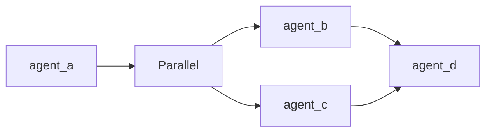

# Flow DSL Guide

**Maneuver Pattern - String-based Workflow Orchestration**

## Table of Contents

- [Introduction](#introduction)
- [Motivation](#motivation)
- [Quick Start](#quick-start)
- [Syntax Reference](#syntax-reference)
- [Error Handling Strategies](#error-handling-strategies)
- [Visualization](#visualization)
- [Best Practices](#best-practices)
- [Troubleshooting](#troubleshooting)
- [Performance Considerations](#performance-considerations)
- [Examples](#examples)

---

## Introduction

The **Flow DSL** (Domain-Specific Language) is a concise, human-readable syntax for defining multi-agent orchestration workflows in Paladin. Instead of programmatically constructing execution graphs, you can express complex workflows using simple text strings.

**Example:**
```
"analyzer -> (summarizer, translator) -> reviewer"
```

This single line defines a workflow where:
1. `analyzer` processes the input
2. `summarizer` and `translator` run in parallel on the analyzer's output
3. `reviewer` combines the results from both parallel branches

The Flow DSL powers the **Maneuver** battalion pattern, enabling dynamic, flexible agent coordination with minimal code.

---

## Motivation

### Why Flow DSL?

Traditional multi-agent orchestration requires:
- Complex graph construction code
- Manual dependency management
- Verbose configuration files
- Difficult-to-understand execution flow

**Flow DSL solves these problems by:**

✅ **Simplicity**: Express complex workflows in a single line  
✅ **Readability**: Non-technical stakeholders can understand workflows  
✅ **Flexibility**: Change execution patterns without code changes  
✅ **Visualization**: Automatic ASCII/Mermaid diagram generation  
✅ **Validation**: Parse-time error detection with helpful messages  

### When to Use Flow DSL

Use Flow DSL (Maneuver pattern) when:
- Workflow structure may change frequently
- You need human-readable workflow definitions
- Sequential and parallel patterns need to be mixed
- Workflow visualization is important
- Dynamic agent rearrangement is needed

**Don't use** when:
- Very simple sequential pipelines (use Formation)
- Pure parallel processing (use Phalanx)
- Complex conditional branching (use Campaign)
- Need hierarchical delegation (use Chain of Command)

---

## Quick Start

### 1. Define Your Flow

```rust
use paladin::core::platform::container::battalion::parser::FlowParser;

// Simple sequential flow
let flow = FlowParser::parse("agent1 -> agent2 -> agent3")?;

// Parallel execution
let flow = FlowParser::parse("(agent1, agent2, agent3)")?;

// Mixed: fan-out then fan-in
let flow = FlowParser::parse("input -> (process1, process2) -> output")?;
```

### 2. Create Paladins

```rust
use std::collections::HashMap;
use paladin::core::platform::container::paladin::Paladin;

let mut agents = HashMap::new();
agents.insert("agent1".to_string(), create_paladin("agent1", "...")?);
agents.insert("agent2".to_string(), create_paladin("agent2", "...")?);
```

### 3. Build and Execute Maneuver

```rust
use paladin::core::platform::container::battalion::maneuver::{Maneuver, ManeuverConfig};

let config = ManeuverConfig::new();
let maneuver = Maneuver::new("my-workflow", agents, flow, config)?;

let result = maneuver_service.execute(&maneuver, "process this input").await?;
println!("Final output: {}", result.final_output);
```

### 4. Using the CLI

```bash
# Create a Maneuver template
paladin battalion new my-workflow --type maneuver --output workflow.yaml

# Edit the flow in workflow.yaml
# flow: "analyzer -> (summarizer, translator) -> reviewer"

# Run the workflow
paladin battalion run --config workflow.yaml --type maneuver

# Visualize the flow
paladin maneuver visualize --config workflow.yaml --format ascii
```

---

## Syntax Reference

### Basic Elements

#### Agents

An agent is a named Paladin identified by an alphanumeric string (with underscores and hyphens allowed).

```
agent_name
my-agent-1
ResearcherAgent
```

**Rules:**
- Must start with a letter or underscore
- Can contain: letters, digits, underscores, hyphens
- Case-sensitive
- Must exist in the agents map

#### Sequential Operator: `->`

The arrow operator chains agents sequentially. Output of agent N becomes input of agent N+1.

```
agent1 -> agent2 -> agent3
```

**Execution order:** `agent1` → `agent2` → `agent3` (sequential)

**Data flow:** Each agent's output is passed as input to the next agent.

#### Parallel Operator: `,`

The comma separates agents that execute concurrently.

```
(agent1, agent2, agent3)
```

**Execution order:** All three agents run simultaneously with the same input.

**Data flow:** Each agent receives the same input. Outputs are aggregated based on `output_format` config.

### Operator Precedence

**Precedence rules** (high to low):
1. **Parentheses** `()` - Highest precedence, forces grouping
2. **Parallel** `,` - Groups parallel execution
3. **Sequential** `->` - Lowest precedence, chains execution

**Example:**
```
a -> b, c -> d
```
This is parsed as: `a -> (b, c) -> d` (**NOT** as `(a -> b), (c -> d)`)

To override precedence, use parentheses:
```
(a -> b), (c -> d)  # Two separate sequential chains in parallel
```

### Grouping with Parentheses

Parentheses group agents for parallel execution and control precedence.

#### Pattern: Fan-Out
```
agent1 -> (agent2, agent3, agent4)
```
- `agent1` runs first
- Its output is sent to `agent2`, `agent3`, and `agent4` **simultaneously**
- All three parallel agents receive the same input

#### Pattern: Fan-In
```
(agent1, agent2, agent3) -> agent4
```
- `agent1`, `agent2`, `agent3` run **simultaneously**
- `agent4` receives their aggregated outputs

#### Pattern: Nested Parallel
```
agent1 -> ((agent2 -> agent3), agent4) -> agent5
```
- `agent1` runs first
- In parallel:
  - Branch 1: `agent2` then `agent3` (sequential within parallel)
  - Branch 2: `agent4`
- `agent5` receives both branch outputs

**Note:** Nested parallel expressions (parallel inside parallel) are **not** supported:
```
❌ (a, (b, c))  # Invalid: parallel inside parallel
✅ (a, b, c)    # Valid: flat parallel
✅ (a -> b, c)  # Valid: sequential inside parallel
```

### Complete Syntax Grammar

```ebnf
expression     = sequential
sequential     = parallel ( "->" parallel )*
parallel       = primary ( "," primary )*
primary        = agent | "(" expression ")"
agent          = IDENTIFIER

IDENTIFIER     = [a-zA-Z_][a-zA-Z0-9_-]*
```

### Example Patterns

#### Simple Sequential
```
"step1 -> step2 -> step3"
```

#### Simple Parallel
```
"(worker1, worker2, worker3)"
```

#### Fan-Out Pattern
```
"coordinator -> (worker1, worker2, worker3)"
```

#### Fan-In Pattern
```
"(collector1, collector2, collector3) -> aggregator"
```

#### Diamond Pattern
```
"input -> (branch1, branch2) -> output"
```

#### Complex Nested
```
"intake -> (quick_analysis, deep_analysis -> validation) -> synthesis -> report"
```

#### Multi-Stage Pipeline
```
"ingest -> parse -> (analyze, translate, summarize) -> combine -> publish"
```

---

## Error Handling Strategies

The Maneuver pattern supports three error handling strategies via `ManeuverConfig`:

### 1. FailFast (Default)

**Behavior:** Stop execution immediately on the first error.

**Use when:**
- Any agent failure invalidates the entire workflow
- You need strong consistency guarantees
- Partial results are not useful

**Example:**
```rust
let config = ManeuverConfig::new()
    .with_error_strategy(ManeuverErrorStrategy::FailFast);
```

**Result:** If `agent2` fails, `agent3` never executes.

### 2. ContinueParallel

**Behavior:** Continue parallel branches on error, but fail sequential chains.

**Use when:**
- Parallel agents are independent
- Some partial results are better than none
- You want to maximize output even with failures

**Example:**
```rust
let config = ManeuverConfig::new()
    .with_error_strategy(ManeuverErrorStrategy::ContinueParallel);
```

**Scenario:** `"a -> (b, c, d) -> e"`
- If `c` fails: `b` and `d` continue executing
- `e` receives outputs from `b` and `d` only
- Error is reported but doesn't stop parallel execution

### 3. IgnoreErrors

**Behavior:** Log errors but continue all execution.

**Use when:**
- Best-effort execution is acceptable
- You need maximum resilience
- Failures should be recorded but not blocking

**Example:**
```rust
let config = ManeuverConfig::new()
    .with_error_strategy(ManeuverErrorStrategy::IgnoreErrors);
```

**Warning:** Use with caution. Downstream agents may receive incomplete or invalid inputs.

### Error Inspection

All errors are captured in `ManeuverResult`:

```rust
match result.status {
    ManeuverStatus::Success => println!("All agents completed successfully"),
    ManeuverStatus::PartialSuccess => {
        println!("Some agents failed but workflow continued");
        // Check step_outputs to see which agents succeeded
    }
    ManeuverStatus::Failed => println!("Workflow failed"),
}
```

---

## Visualization

The Flow DSL supports automatic visualization in two formats: **ASCII** and **Mermaid**.

### ASCII Visualization

Human-readable tree format for terminal display.

```rust
use paladin::application::services::battalion::flow_visualizer::FlowVisualizer;

let flow = FlowParser::parse("a -> (b, c) -> d")?;
let ascii = FlowVisualizer::to_ascii(&flow);
println!("{}", ascii);
```

**Output:**
```
└─> a
    └─> [PARALLEL]
         ├─> b
         └─> c
    └─> d
```

### Mermaid Visualization

Generates valid Mermaid.js flowchart syntax for documentation and diagrams.

```rust
let mermaid = FlowVisualizer::to_mermaid(&flow);
println!("{}", mermaid);
```

**Output:**


You can render this in:
- GitHub README files
- GitLab wikis
- Mermaid Live Editor
- Documentation sites

### Timing Metrics Overlay

Display execution times and identify bottlenecks:

```rust
use std::time::Duration;
use std::collections::HashMap;

let mut metrics = HashMap::new();
metrics.insert("a".to_string(), Duration::from_millis(100));
metrics.insert("b".to_string(), Duration::from_millis(250));
metrics.insert("c".to_string(), Duration::from_millis(150));

let ascii_with_timing = FlowVisualizer::with_timing(&flow, &metrics);
println!("{}", ascii_with_timing);
```

**Output:**
```
└─> a [100ms]
    └─> [PARALLEL]
         ├─> b [250ms] ⚠️  BOTTLENECK
         └─> c [150ms]

Total: 500ms
```

### CLI Visualization

```bash
# ASCII format (default)
paladin maneuver visualize --config workflow.yaml

# Mermaid format
paladin maneuver visualize --config workflow.yaml --format mermaid

# Save to file
paladin maneuver visualize --config workflow.yaml --format mermaid --output flow.md
```

---

## Best Practices

### 1. Keep Flows Readable

✅ **Good:**
```
"intake -> parse -> (analyze, translate) -> output"
```

❌ **Bad:**
```
"a->b->(c,d,e,f,g,h,i)->j->k->l->m->(n,o,p)->q"
```

**Tip:** If your flow exceeds ~80 characters, consider breaking it into multiple Maneuvers.

### 2. Use Descriptive Agent Names

✅ **Good:**
```
"user_input_validator -> content_analyzer -> report_generator"
```

❌ **Bad:**
```
"agent1 -> agent2 -> agent3"
```

**Tip:** Agent names should describe what the agent does, not just its position.

### 3. Limit Parallel Branching

**Recommended:** 2-5 parallel agents per group  
**Maximum:** 10 parallel agents (performance degrades beyond this)

✅ **Good:**
```
"router -> (processor1, processor2, processor3) -> aggregator"
```

❌ **Bad:**
```
"router -> (p1, p2, p3, p4, p5, p6, p7, p8, p9, p10, p11, p12) -> aggregator"
```

### 4. Validate Before Execution

Always validate your flow expression before runtime:

```bash
paladin maneuver validate --config workflow.yaml --verbose
```

Or in code:
```rust
// Parse validates syntax
let flow = FlowParser::parse(&flow_str)?;

// Maneuver::new validates agent references
let maneuver = Maneuver::new(name, agents, flow, config)?;
```

### 5. Use Visualize During Development

Generate visualizations to verify your workflow logic:

```bash
paladin maneuver visualize --config workflow.yaml --format ascii
```

Review the visualization before deploying to production.

### 6. Handle Errors Appropriately

Choose error strategy based on your use case:

- **Critical workflows:** Use `FailFast` (default)
- **Data processing pipelines:** Use `ContinueParallel`
- **Best-effort aggregation:** Use `IgnoreErrors` (with caution)

### 7. Monitor Timing Metrics

Enable timing collection to identify bottlenecks:

```rust
let config = ManeuverConfig::new()
    .with_collect_timing_metrics(true);
```

Then visualize:
```rust
let ascii = FlowVisualizer::with_timing(&flow, &result.timing_metrics.unwrap());
```

### 8. Test with Simple Flows First

Start with simple patterns and gradually increase complexity:

1. Start: `"a -> b"`
2. Add parallel: `"a -> (b, c)"`
3. Add fan-in: `"a -> (b, c) -> d"`
4. Add nesting: `"a -> (b -> c, d) -> e"`

### 9. Document Your Flows

Add comments in YAML configs:

```yaml
# Flow: Document processing pipeline
# - intake: Receives and validates document
# - analyze: Extracts key information
# - summarize/translate: Parallel processing
# - output: Generates final report
flow: "intake -> analyze -> (summarize, translate) -> output"
```

### 10. Keep Agent Count Reasonable

**Recommended limits:**
- Total agents in flow: ≤ 30
- Nesting depth: ≤ 5 levels
- Sequential chain: ≤ 15 agents

These limits ensure good performance and maintainability.

---

## Troubleshooting

### Common Errors

#### Error: "Unexpected token"

**Cause:** Invalid character or operator in flow expression.

**Example:**
```
"agent1 | agent2"  # Wrong: use comma, not pipe
```

**Solution:**
```
"(agent1, agent2)"  # Correct: use comma for parallel
```

#### Error: "Unbalanced parentheses"

**Cause:** Missing opening or closing parenthesis.

**Example:**
```
"a -> (b, c -> d"  # Missing closing )
```

**Solution:**
```
"a -> (b, c) -> d"  # Correct: balanced parentheses
```

#### Error: "Agent not found: xyz"

**Cause:** Flow references an agent that doesn't exist in the agents map.

**Example:**
```rust
// Flow: "a -> b -> c"
// But agents only has "a" and "b"
```

**Solution:**
```rust
agents.insert("c".to_string(), create_paladin("c", ...)?);
```

#### Error: "Consecutive operators"

**Cause:** Two operators without an agent between them.

**Example:**
```
"a -> -> b"
"(a,, b)"
```

**Solution:**
```
"a -> b"
"(a, b)"
```

#### Error: "Empty expression"

**Cause:** Empty string or empty parentheses.

**Example:**
```
""
"a -> () -> b"
```

**Solution:**
```
"a"
"a -> b"
```

#### Error: "Nested parallel expressions not supported"

**Cause:** Parallel group inside another parallel group.

**Example:**
```
"(a, (b, c))"  # Parallel inside parallel
```

**Solution:**
```
"(a, b, c)"    # Flatten to single parallel
```

### Debugging Tips

#### 1. Use Verbose Validation

```bash
paladin maneuver validate --config workflow.yaml --verbose
```

This shows:
- Parsed flow structure
- Agent names extracted
- Agent existence verification
- Configuration validation

#### 2. Visualize Before Running

```bash
paladin maneuver visualize --config workflow.yaml
```

Visual inspection can reveal logic errors that aren't syntax errors.

#### 3. Test with Mock Agents

Create simple mock agents to test flow logic:

```rust
let mock_agent = PaladinBuilder::new(llm_port)
    .name("mock")
    .system_prompt("Just return 'OK'")
    .build()?;
```

#### 4. Check Execution Order

Enable verbose mode to see execution order:

```rust
println!("Execution order: {:?}", result.execution_order);
```

#### 5. Inspect Step Outputs

```rust
for (agent_name, output) in &result.step_outputs {
    println!("{}: {}", agent_name, output);
}
```

---

## Performance Considerations

### Parser Performance

The Flow DSL parser is highly optimized:

- **Simple flows** (`a -> b -> c`): < 1μs
- **Complex flows** (30 agents, nested): < 50μs
- **Memory overhead:** ~1KB per parsed expression

**Recommendation:** Parse once, reuse the `FlowExpression` object.

```rust
// ✅ Good: Parse once
let flow = FlowParser::parse(&flow_str)?;
for input in inputs {
    maneuver_service.execute(&maneuver, input).await?;
}

// ❌ Bad: Parse repeatedly
for input in inputs {
    let flow = FlowParser::parse(&flow_str)?;  // Wasteful!
    // ...
}
```

### Execution Performance

**Sequential execution:**
- Time = Σ(agent_time_i) + overhead
- Overhead: ~1-5ms per agent transition

**Parallel execution:**
- Time = max(agent_time_i) + overhead
- Overhead: ~10-20ms for spawn + join

**Optimization tips:**

1. **Parallelize independent work:**
   ```
   # Slow: 300ms
   "analyze -> summarize -> translate"
   
   # Fast: max(150ms, 150ms) = 150ms
   "analyze -> (summarize, translate)"
   ```

2. **Batch small agents:**
   ```
   # Less efficient: Many small agents
   "a -> b -> c -> d -> e -> f"
   
   # More efficient: Combine where possible
   "prepare -> process -> finalize"
   ```

3. **Use appropriate error strategy:**
   - `FailFast`: Fastest failure detection
   - `ContinueParallel`: Better throughput for independent work
   - `IgnoreErrors`: Maximum throughput (use cautiously)

### Memory Usage

**Per Maneuver execution:**
- Base overhead: ~10KB
- Per agent: ~5KB (input/output storage)
- Timing metrics: ~1KB per agent (if enabled)

**Example:** 10-agent Maneuver ≈ 60KB per execution

**Tips:**
- Disable timing metrics in production if not needed
- Clear old results when running many iterations
- Consider streaming for very large outputs

### Scalability Limits

**Tested limits:**
- **Agents per flow:** Up to 30 agents tested
- **Nesting depth:** Up to 5 levels tested
- **Parallel branches:** Up to 10 concurrent agents tested
- **Flow expression length:** Up to 1000 characters tested

**Production recommendations:**
- Keep flows under 20 agents
- Limit nesting to 3 levels
- Use 2-5 parallel branches
- Keep expressions under 200 characters

---

## Examples

### Example 1: Document Processing Pipeline

```rust
// Flow: Sequential analysis with parallel output generation
let flow = FlowParser::parse(
    "ingest -> analyze -> (summarize, translate, extract_keywords) -> finalize"
)?;
```

**Execution:**
1. `ingest`: Receives raw document, validates format
2. `analyze`: Extracts key information and structure
3. Parallel processing:
   - `summarize`: Creates executive summary
   - `translate`: Translates to target language
   - `extract_keywords`: Identifies important terms
4. `finalize`: Combines all outputs into final report

### Example 2: Multi-Stage Review Process

```rust
// Flow: Nested sequential within parallel
let flow = FlowParser::parse(
    "submit -> (tech_review -> tech_approve, legal_review -> legal_approve) -> final_approval"
)?;
```

**Execution:**
1. `submit`: Initial submission processing
2. Two parallel review chains:
   - Technical: `tech_review` → `tech_approve`
   - Legal: `legal_review` → `legal_approve`
3. `final_approval`: Makes final decision based on both reviews

### Example 3: Data Enrichment Pipeline

```rust
// Flow: Fan-out for enrichment, fan-in for aggregation
let flow = FlowParser::parse(
    "validate -> (enrich_demographic, enrich_behavioral, enrich_transaction) -> merge -> score"
)?;
```

**Execution:**
1. `validate`: Cleans and validates input data
2. Parallel enrichment from multiple sources
3. `merge`: Combines enriched data
4. `score`: Calculates final score

### Example 4: Error Handling with ContinueParallel

```rust
let config = ManeuverConfig::new()
    .with_error_strategy(ManeuverErrorStrategy::ContinueParallel);

// Even if one analysis fails, others continue
let flow = FlowParser::parse(
    "preprocess -> (sentiment, entities, topics, language) -> aggregate"
)?;
```

### Example 5: CLI YAML Configuration

`workflow.yaml`:
```yaml
type: maneuver
name: "document-workflow"
flow: "intake -> analyze -> (summarize, translate) -> output"

paladins:
  - inline:
      name: "intake"
      system_prompt: "Validate and prepare the document for processing."
      model: "gpt-4"
      temperature: 0.3
  
  - inline:
      name: "analyze"
      system_prompt: "Extract key information and structure from the document."
      model: "gpt-4"
      temperature: 0.5
  
  - inline:
      name: "summarize"
      system_prompt: "Create a concise summary of the analysis."
      model: "gpt-4"
      temperature: 0.4
  
  - inline:
      name: "translate"
      system_prompt: "Translate the analysis to Spanish."
      model: "gpt-4"
      temperature: 0.3
  
  - inline:
      name: "output"
      system_prompt: "Combine summary and translation into final report."
      model: "gpt-4"
      temperature: 0.4

visualize: "ascii"
```

Run with:
```bash
paladin battalion run --config workflow.yaml --type maneuver
```

---

## Additional Resources

- **API Documentation:** Run `cargo doc --open` for full API reference
- **Battalion Guide:** See [BATTALION.md](../BATTALION.md) for pattern comparisons
- **Examples:** Check `examples/maneuver_*.rs` for runnable code
- **CLI Reference:** Run `paladin maneuver --help` for all commands

---

## Feedback and Contributions

Have questions or suggestions? Please file an issue or contribute to the project!

**Repository:** https://github.com/DF3NDR/paladin-dev-env
