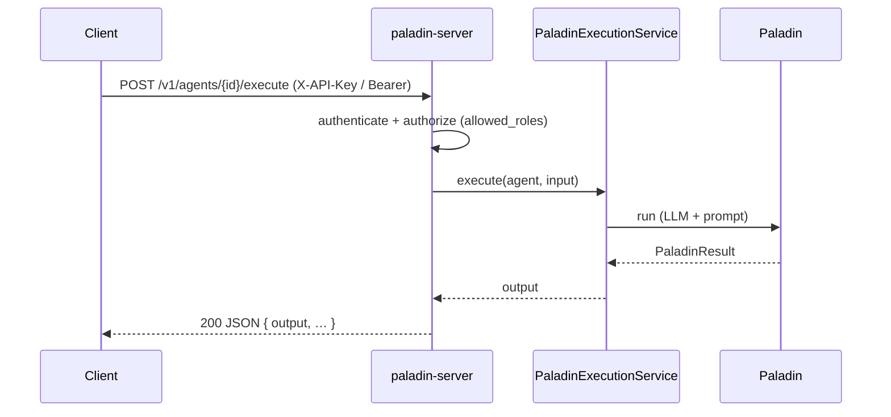

# HTTP Service Host

Run one long-lived process that keeps several distinct agents **resident behind an HTTP
API**, so external clients can invoke them and many requests run concurrently. This is the
closest topology to "a running instance you hit."

> **Paladin ships this out of the box.** The `paladin-server` binary (the `web-server`
> feature) serves a complete agent API — execution, streaming, async jobs, discovery,
> runtime registration, health/readiness, authentication, and an OpenAPI-documented `/v1`
> surface. You configure it; you don't have to compose the endpoint yourself. (You *can*
> still embed the same routes in your own `axum` app — see [Embedding](#embedding-in-your-own-app).)

## When to choose it

- **Choose it when** an external client needs request/response access to your agents, and a
  single in-process call won't do.
- **Look elsewhere when** you only call agents from your own code
  ([embedded library](embedded-library.md)), or you need scale-out / backpressure
  ([queue / worker](queue-worker.md)), or hard per-agent process isolation
  ([sidecar](sidecar.md)).

## The shipped server

The agent API is served under a **`/v1`** version prefix; operational and docs endpoints are
unversioned.

| Method & path | Description |
|---------------|-------------|
| `POST /v1/agents/{id}/execute` | Run an agent, return the full result as JSON |
| `POST /v1/agents/{id}/execute/stream` | Run an agent, stream tokens as SSE (`chunk` … `done`) |
| `POST /v1/agents/{id}/jobs` | Enqueue an async run; returns a `job_id` |
| `GET /v1/agents/{id}/jobs/{job_id}` | Poll a job (`running` → `completed`/`failed`/`timed_out`) |
| `GET /v1/agents` · `GET /v1/agents/{id}` | Discover registered agents |
| `POST /v1/agents` · `DELETE /v1/agents/{id}` | Register / deregister at runtime (**admin**) |
| `GET /health` · `GET /ready` | Liveness / readiness probes (unauthenticated) |
| `GET /openapi.json` · `GET /docs` | OpenAPI 3.1 spec + Swagger UI |

Every error is a structured envelope `{ "error": { "code", "message", "details" } }`; every
response carries an `x-request-id`. Each run is bounded by a timeout (server default,
per-agent, or per-request), and on expiry the work is cancelled (`504`, or a terminal `error`
SSE event).

## Request flow



> **This topology carries no Garrison and no Arsenal.** An HTTP-served agent has no memory
> (Garrison) and no tools/MCP (Arsenal) — `AgentSpec` has no field for either, and this is a
> permanent property of the shipped topology, not a gap awaiting a future release. If your
> agent needs memory or tools, build it on the [embedded library](embedded-library.md)
> topology instead (optionally wrapped in your own HTTP layer, as shown in
> [Embedding](#embedding-in-your-own-app) below).

## Configuring the host

Agents and host settings come from `config.yml` (see
[`config.example.yml`](https://github.com/DF3NDR/paladin-dev-env/blob/main/config.example.yml)).
A minimal shape:

```yaml
server:
  host: "0.0.0.0"
  port: 8080

http:
  auth:
    enabled: true                  # fail-closed: the server refuses to start with no credentials
    api_keys:
      - { key: "${PALADIN_API_KEY_CI}", name: "ci", role: "admin" }
  docs:
    enabled: true                  # GET /openapi.json + Swagger UI at /docs

agents:
  - id: "researcher"
    model: "gpt-4"
    system_prompt: "You research topics thoroughly."
    allowed_roles: ["admin", "user"]   # empty ⇒ any authenticated caller
```

### Authentication & authorization

Auth is **enabled by default and fail-closed** — with no credentials configured the server
refuses to start (set `http.auth.enabled: false` for trusted/dev use). Callers present an
**API key** (`X-API-Key`) or an **opaque server-issued bearer token** (`Authorization: Bearer`),
verified against the server's own token store — not a signed or self-describing token; a
key/token maps to a role. Per-agent `allowed_roles` gate invocation, and runtime
register/deregister require an `admin` role. `/health`, `/ready`, `/openapi.json`, and `/docs`
are always reachable without a credential.

## Running it

**Binary:**

```bash
PALADIN_CONFIG=./config.yml \
OPENAI_API_KEY=sk-... PALADIN_API_KEY_CI=sk-... \
cargo run --bin paladin-server --features web-server
```

**Docker** ([`Dockerfile.server`](https://github.com/DF3NDR/paladin-dev-env/blob/main/Dockerfile.server)):

```bash
make docker-build-server
docker run --rm -p 8080:8080 \
  -e OPENAI_API_KEY=sk-... -e PALADIN_API_KEY_CI=sk-... paladin-server:latest
# or: docker compose -f docker/docker-compose.server.yml up --build
```

**Kubernetes** ([`k8s/server/`](https://github.com/DF3NDR/paladin-dev-env/tree/main/k8s/server)) —
Deployment + Service + ConfigMap with liveness `/health` and readiness `/ready` probes:

```bash
kubectl apply -f k8s/namespace.yaml
kubectl apply -f k8s/server/secret.yaml -f k8s/server/
```

## Versioning

The agent API is versioned under `/v1`: only additive, backward-compatible changes are made
within it; breaking changes ship under a new prefix (`/v2`). The `/openapi.json` contract is
generated from the handlers and guarded against drift.

## Embedding in your own app

You can also mount the agent registry and your own handler inside an existing `axum` app
instead of running the binary. `cargo check` compiles this in full, so it can't drift from
the API:

```rust
{{#include ../../../crates/doc-examples/src/http_service_host.rs:http_host}}
```

## See also

- The bundled user/auth routes (`paladin-web`) a real service often also needs —
  [Crate Map & Feature Flags](../api-reference/crate-map.md).
- Running the same agent host in a *separate* process, called over the network —
  [Sidecar](sidecar.md).

---

← Back to [Choosing a topology](overview.md)
