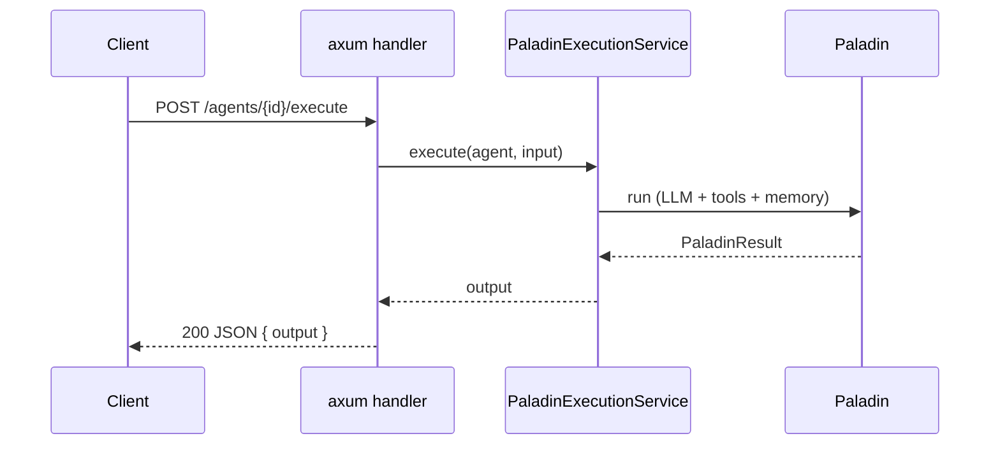

# HTTP Service Host

Run one long-lived process that keeps several distinct agents **resident behind an HTTP
API**, so external clients can invoke them and many requests run concurrently. This is the
closest topology to "a running instance you hit."

> The example below is compiled code pulled from the `paladin-doc-examples` crate via mdBook
> `{{#include}}`, so it matches the current `axum` + Paladin API.

> **Paladin ships no agent-execution endpoint.** The web crate's
> [`create_app_router`](../api-reference/crate-map.md) wires a **user-management / auth**
> REST API (`/users/register`, `/users/login`, user CRUD) — it does *not* run agents. The
> agent endpoint is yours to compose: an `axum` handler over a shared
> [agent registry](embedded-library.md) that calls `PaladinExecutionService`. That is exactly
> what the example below does.

## When to choose it

- **Choose it when** an external client needs request/response access to your agents, and a
  single in-process call won't do.
- **Look elsewhere when** you only call agents from your own code
  ([embedded library](embedded-library.md)), or you need scale-out / backpressure
  ([queue / worker](queue-worker.md)), or hard per-agent process isolation
  ([sidecar](sidecar.md)).

## Request flow



## Example: agents behind Axum

The handler looks an agent up by id in the shared registry and runs it. `cargo check`
compiles this in full — including the `axum::serve` bind — so it can never drift from the
real API:

```rust
{{#include ../../../crates/doc-examples/src/http_service_host.rs:http_host}}
```

## Configuring the host

Host and per-agent settings typically come from your `config.yml` rather than being
hard-coded. A minimal shape:

```yaml
host:
  bind_address: "0.0.0.0:3000"
agents:
  - id: "researcher"
    model: "gpt-4"
    system_prompt: "You research topics thoroughly."
  - id: "summarizer"
    model: "gpt-4"
    system_prompt: "You write concise summaries."
```

## See also

- The bundled user/auth routes (`paladin-web`) a real service often also needs —
  [Crate Map & Feature Flags](../api-reference/crate-map.md).
- Running the same agent host in a *separate* process, called over the network —
  [Sidecar](sidecar.md).

---

← Back to [Choosing a topology](overview.md)
