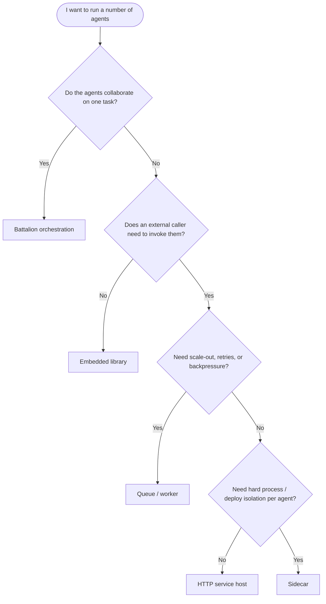

# Deployment Topologies — Choosing How to Run Your Agents

A **deployment topology** is *how you run agents* — the process and concurrency model —
independent of *how you package and ship* them (Docker, Kubernetes, CI/CD, which live in the
[Deployment](../deployment/docker.md) section). The two are complementary: you pick a
topology here, then package it there.

If you want to build a number of different agents on top of Paladin, the first decision is
which of these five topologies fits. Paladin is designed to be **embedded as a library** —
`paladin-ai` (library name `paladin`) is your composition root, not a framework that owns
your process — so every topology below is something you assemble in your own binary.

## The five topologies at a glance

| Topology | Process model | Concurrency | Use when | Avoid when | Key crates / features |
|---|---|---|---|---|---|
| [Embedded library](embedded-library.md) | One process, agents in your `main` | `tokio` tasks; agents are `Send + Sync` behind `Arc` | You control invocation in-code and want the simplest setup | You need an external caller or independent scaling | `paladin-ai` |
| [Battalion orchestration](battalion-orchestration.md) | One process, many agents collaborating | Built-in (Phalanx parallel, Campaign DAG, …) | The agents form a *workflow* on one task | The agents are independent request handlers | `paladin-battalion` |
| [HTTP service host](http-service-host.md) | One long-running process, agents resident behind an API | Concurrent requests over a shared agent registry | You need request/response access to many agents | A single embedded call already suffices, or the agent needs Garrison memory or Arsenal tools (neither ships on this topology — see [embedded library](embedded-library.md)) | **`paladin-server` (ships out of the box, `web-server` feature)**: `/v1` agent API, auth, OpenAPI docs |
| [Queue / worker (distributed)](queue-worker.md) | Producer(s) + a pool of worker processes | Horizontal scale; backpressure via the queue | You need scale-out, retries, or fault isolation | Load is low and in-process execution is enough | `paladin-storage` (`redis-queue`) |
| [Sidecar (separate process)](sidecar.md) | Agent in its own process, called over the network | Per-sidecar; caller is decoupled | You need hard process/security/deploy isolation per agent | In-process hosting gives the same benefit cheaper | HTTP host + an HTTP client (no IPC ships today) |

> **Capability note — Garrison and Arsenal.** Only the [embedded library](embedded-library.md)
> topology (and, by inheritance, the queue/worker topology, since each worker is itself an
> embedded agent host) has agent memory (Garrison) and tools/MCP (Arsenal) available today. The
> [HTTP service host](http-service-host.md) topology carries neither — this is a permanent
> property of the shipped topology, not scheduled work. If an HTTP-served agent needs memory or
> tools, build it on the embedded-library topology instead.

> **Two of these are documented in depth elsewhere.** The embedded-library and Battalion
> pages here are short topology overviews — they link to the full
> [Paladin Agents](../user-guides/paladin-agents.md) and
> [Orchestration Patterns](../user-guides/orchestration.md) guides for the complete API.

## Choosing a topology

## Recommendation

Start with the **[embedded library](embedded-library.md)** topology (and
**[Battalion](battalion-orchestration.md)** when agents collaborate). When you need an
external caller, wrap it in an **[HTTP service host](http-service-host.md)**. Reach for the
**[queue / worker](queue-worker.md)** topology only when load or fault-isolation demands it,
and the **[sidecar](sidecar.md)** topology only when you need process isolation that
in-process hosting cannot give — it carries the most operational overhead.

These topologies also compose: a worker process is an embedded host; a sidecar is an HTTP
host called from another process.
