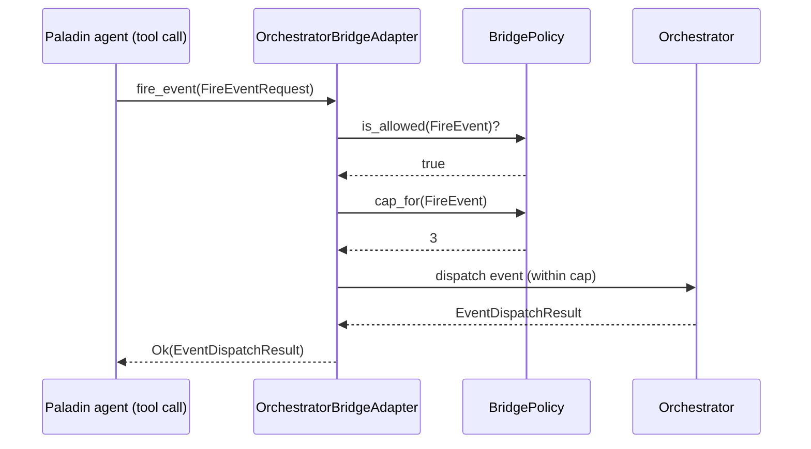
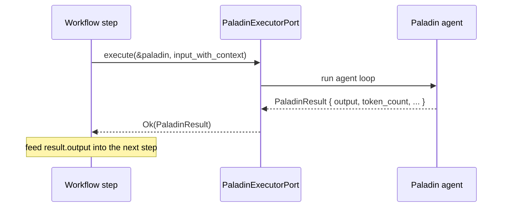

# Agent ↔ Orchestrator Bridge

Paladin agents and Battalion workflows interact **bidirectionally**:

- An **agent can trigger orchestration** — schedule a job, enqueue an item, fire an event, or
  send a notification — through a narrow, policy-guarded port.
- A **workflow can invoke an agent** — run a single Paladin or a whole Battalion as a step and
  feed its output back into the workflow.

This guide covers both directions, how to configure the bridge safely, and four end-to-end
recipes. It builds on the [Orchestration](orchestration.md) and
[Content Processing](content-processing.md) guides.

> Every example targets the current **v0.4.3** workspace and is marked `rust,ignore`. API forms
> are verified against `crates/paladin-ports/src/output/orchestrator_port.rs`,
> `paladin_executor_port.rs`, `battalion_port.rs`, and the concrete
> `OrchestratorBridgeAdapter` in `src/application/services/orchestration/`.

---

## Table of Contents

1. [Agents Triggering Orchestration](#agents-triggering-orchestration)
2. [Orchestration Invoking Agents](#orchestration-invoking-agents)
3. [Configuring the Bridge](#configuring-the-bridge)
4. [Use-Case Recipes](#use-case-recipes)
5. [See Also](#see-also)

---

## Agents Triggering Orchestration

The seam is `OrchestratorPort` (`crates/paladin-ports/src/output/orchestrator_port.rs`). It
exposes exactly four actions, mirrored by the `BridgeAction` enum:

| `BridgeAction` | `OrchestratorPort` method | Request type | Returns |
|----------------|---------------------------|--------------|---------|
| `ScheduleJob` | `schedule_job` | `ScheduleJobRequest` | `Uuid` |
| `QueueItem` | `queue_item` | `QueueItemRequest` | `Uuid` |
| `FireEvent` | `fire_event` | `FireEventRequest` | `EventDispatchResult` |
| `SendNotification` | `send_notification` | `SendNotificationRequest` | `Uuid` |

The concrete adapter, `OrchestratorBridgeAdapter`, wraps an `Arc<Orchestrator>` and a
`BridgePolicy`. It enforces the policy **before** performing any underlying call, so an agent can
never exceed the actions or per-execution caps it was granted.



### Tool-based invocation from an agent loop

Expose the bridge to a Paladin as a tool. When the agent decides to act, the tool implementation
calls the relevant `OrchestratorPort` method. The agent never touches the `Orchestrator`
directly — only the policy-guarded port.

```rust,ignore
use std::sync::Arc;
use paladin_ports::output::orchestrator_port::{
    BridgeAction, FireEventRequest, OrchestratorBridgeError, OrchestratorPort,
};
use paladin::application::services::orchestration::orchestrator_bridge::OrchestratorBridgeAdapter;
use paladin_ports::output::orchestrator_port::BridgePolicy;

#[tokio::main]
async fn main() -> Result<(), Box<dyn std::error::Error>> {
    // Grant ONLY the actions this agent should perform, with explicit caps.
    let mut allowed = std::collections::HashSet::new();
    allowed.insert(BridgeAction::FireEvent);
    let policy = BridgePolicy::new(allowed, 0, 0, 5, 0); // up to 5 events, nothing else

    let bridge: Arc<dyn OrchestratorPort> =
        Arc::new(OrchestratorBridgeAdapter::new(orchestrator, policy));

    // Inside the agent's tool handler:
    match bridge
        .fire_event(FireEventRequest {
            event_type: "critical_finding".to_string(),
            payload: serde_json::json!({ "severity": "high" }),
            source: "security-agent".to_string(),
        })
        .await
    {
        Ok(result) => println!("fired; {} trigger(s) matched", result.triggered_count),
        Err(OrchestratorBridgeError::ActionNotAllowed(_)) => {
            eprintln!("policy forbids this action")
        }
        Err(OrchestratorBridgeError::QuotaExceeded { .. }) => {
            eprintln!("per-execution cap reached")
        }
        Err(e) => return Err(e.into()),
    }
    Ok(())
}
```

`OrchestratorBridgeError` distinguishes `ActionNotAllowed` (the policy doesn't grant the action)
from `QuotaExceeded` (the per-execution cap is reached), so an agent can react sensibly instead
of failing opaquely.

---

## Orchestration Invoking Agents

The reverse direction uses the executor ports:

- **`PaladinExecutorPort`** (`paladin_executor_port.rs`) — run a single Paladin:
  `async fn execute(&self, paladin: &Paladin, input: &str) -> Result<PaladinResult, PaladinError>`.
- **`BattalionPort`** (`battalion_port.rs`) — run/monitor a whole Battalion by id:
  `execute(battalion_id) -> BattalionResult`, plus `status` and `cancel`.

A workflow step builds the input string (passing context from earlier steps), calls the executor,
and reads the result back out.



```rust,ignore
use std::sync::Arc;
use paladin_ports::output::paladin_executor_port::PaladinExecutorPort;

#[tokio::main]
async fn main() -> Result<(), Box<dyn std::error::Error>> {
    let executor: Arc<dyn PaladinExecutorPort> = Arc::new(/* adapter */);

    // Pass workflow context into the agent via the input string.
    let upstream = "Q3 revenue rose 12% QoQ; churn fell to 2.1%.";
    let input = format!("Summarize the key risks given this context:\n{upstream}");

    let result = executor.execute(&analyst_paladin, &input).await?;

    // Return the agent's output back to the workflow.
    println!("agent said: {}", result.output);
    println!("tokens: {}, stop reason: {:?}", result.token_count, result.stop_reason);
    Ok(())
}
```

`PaladinResult` carries `output`, `token_count`, `execution_time_ms`, `loop_count`, and
`stop_reason` — everything the workflow needs to decide what to do next. To invoke a whole
Battalion instead of a single agent, use `BattalionPort::execute(battalion_id)` and read the
`BattalionResult` (see [Orchestration → Configuration Reference](orchestration.md#configuration-reference)).

---

## Configuring the Bridge

Bridge behavior is configured **programmatically** through `BridgePolicy` — there is no dedicated
`config.yml` bridge section in v0.4.3. A policy is two things: the set of *allowed* actions, and a
*per-execution cap* for each action.

```rust,ignore
use std::collections::HashSet;
use paladin_ports::output::orchestrator_port::{BridgeAction, BridgePolicy};

// Explicit, least-privilege policy: allow scheduling + notifications only,
// with caps of (jobs=2, queue=0, events=0, notifications=5).
let mut allowed = HashSet::new();
allowed.insert(BridgeAction::ScheduleJob);
allowed.insert(BridgeAction::SendNotification);
let policy = BridgePolicy::new(allowed, 2, 0, 0, 5);

// Builder-style: start from one action and add more.
let policy = BridgePolicy::new(HashSet::new(), 1, 1, 1, 1)
    .allow(BridgeAction::FireEvent)
    .allow(BridgeAction::QueueItem);
```

The `Default` policy is deliberately conservative-but-usable: **all four actions allowed with a
cap of 3 each**. Prefer an explicit least-privilege policy for agents you don't fully trust.

```rust,ignore
let policy = BridgePolicy::default(); // all actions, cap 3 each
```

> **Tip:** because the adapter enforces the policy before every call, tightening a policy is a
> safe, local change — you don't have to audit the agent's prompt to constrain what it can do.

---

## Use-Case Recipes

### 1. News monitoring pipeline with AI analysis

`NewsApiFetcher` → AI summarization (`LlmContentAnalyzer`) → notification via the bridge.

```rust,ignore
// 1. Fetch latest articles (see content-processing.md)
let item = news_fetcher_fetch_latest().await?;
// 2. Summarize with a Paladin (LlmContentAnalyzer, feature "llm")
let analysis = analyzer.analyze_with_prompt_async(&input, &config).await?;
// 3. Notify through the bridge (policy must allow SendNotification)
bridge
    .send_notification(SendNotificationRequest {
        channel: "email".to_string(),
        recipient: "ops@example.com".to_string(),
        subject: "Daily news digest".to_string(),
        body: analysis.to_string(),
    })
    .await?;
```

See [Content Processing](content-processing.md) for the ingestion/analysis half and
[Orchestration → Job Scheduling](orchestration.md#job-scheduling) to run this on a cron.

### 2. Research workflow

A web/HTTP tool gathers sources, a Paladin synthesizes them, and a **Formation** assembles the
final report.

```rust,ignore
// 1. Agent gathers sources via an HTTP tool (Arsenal), producing notes.
// 2. Synthesis Paladin run as a workflow step:
let synthesis = executor.execute(&synthesizer, &collected_notes).await?;
// 3. Formation assembles intro → body → conclusion from the synthesis.
let report = formation_service.execute(&report_formation, &synthesis.output).await?;
```

### 3. Scheduled batch enrichment (job queue)

A recurring job enqueues items; a worker drains the queue and runs each through a Paladin.

```rust,ignore
// Daily at 02:00, schedule a batch-enrichment job (policy allows ScheduleJob).
bridge
    .schedule_job(ScheduleJobRequest {
        name: "nightly-enrichment".to_string(),
        description: "Enrich the day's content with AI tags".to_string(),
        schedule, // a Schedule value (cron)
    })
    .await?;

// Enqueue each raw item for asynchronous processing (policy allows QueueItem).
bridge
    .queue_item(QueueItemRequest {
        queue_name: "enrichment".to_string(),
        payload: serde_json::json!({ "content_id": id }),
    })
    .await?;
```

### 4. Trigger-initiated agent run

An agent fires a domain event; a registered [Trigger](orchestration.md#event-and-trigger-system)
matches it and initiates a Paladin run — fully event-driven, no polling.

```rust,ignore
// Agent A detects an anomaly and fires an event through the bridge.
let dispatch = bridge
    .fire_event(FireEventRequest {
        event_type: "anomaly_detected".to_string(),
        payload: serde_json::json!({ "metric": "latency_p99", "value": 920 }),
        source: "monitor-agent".to_string(),
    })
    .await?;

// A Trigger whose condition matches `anomaly_detected` then runs a remediation
// Paladin via PaladinExecutorPort. `dispatch.triggered_count` reports the match count.
println!("{} trigger(s) initiated", dispatch.triggered_count);
```

---

## See Also

- [Orchestration](orchestration.md) — the Battalion patterns, job scheduler, and trigger system the bridge drives.
- [Content Processing](content-processing.md) — the ingestion/analysis pipeline used in recipes 1 and 3.
- [Paladin Agents](paladin-agents.md) — building the agents on both sides of the bridge.
- [Crate Map](../api-reference/crate-map.md#paladin-ports) — where `OrchestratorPort` and the executor ports live.
