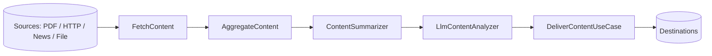

# Content Processing

The `paladin-content` crate (`crates/paladin-content/`) ingests content from external sources,
runs it through aggregation/analysis use cases, hands it to a Paladin agent for AI enrichment,
and delivers the result. This guide covers the **ingestion adapters**, the **processing
use cases**, the **content → agent bridge**, and **delivery** — documenting only what is wired
into the compiled crate today.

> Every code example targets the current **v0.4.3** workspace and is marked `rust,ignore`
> (the surrounding wiring — building a Paladin, choosing a runtime — lives elsewhere). The API
> forms are verified against `crates/paladin-content/src/`.

> **Feature flags.** Content processing lives behind the root `content-processing` feature,
> which enables `paladin-content`. Within the crate, `news-api` enables the News API fetcher and
> `llm` enables LLM-powered analysis. See the [Crate Map](../api-reference/crate-map.md#paladin-content)
> for the full flag table.

---

## Table of Contents

1. [Content Ingestion Sources](#content-ingestion-sources)
2. [Aggregation and the Processing Pipeline](#aggregation-and-the-processing-pipeline)
3. [Content → Agent Bridge](#content--agent-bridge)
4. [Content Delivery](#content-delivery)
5. [Capabilities and Limitations](#capabilities-and-limitations)
6. [See Also](#see-also)

---

## Content Ingestion Sources

Every fetcher produces a `ContentItem`
(`paladin_core::platform::container::content::ContentItem`), the common currency of the
pipeline. Sources are constructed and configured **programmatically** (there is no dedicated
`content:` section in `config.yml` yet — see [Limitations](#capabilities-and-limitations)).

### PDF / documents — `PdfExtractor`

`PdfExtractor` parses a PDF (from a path or raw bytes) into a `Document`. `DocumentAdapter`
wraps document parsing for the pipeline.

```rust,ignore
use paladin_content::adapters::document::pdf_extractor::PdfExtractor;
use std::path::Path;

let extractor = PdfExtractor::new();
let document = extractor.extract(Path::new("./reports/q3-earnings.pdf"))?;
// Or from bytes already in memory:
// let document = extractor.extract_bytes(&pdf_bytes)?;
```

### HTTP endpoints — `HttpContentFetcher`

`HttpContentFetcher` fetches a URL and returns a `ContentItem`. It implements the
`ContentFetchingService` trait, so it can be driven directly or through the `FetchContent`
use case.

```rust,ignore
use paladin_content::adapters::input::http_content_fetcher::HttpContentFetcher;
use paladin_content::services::content_fetching_service::{ContentFetchingService, FetchContent};

let fetcher = HttpContentFetcher::new();

// Direct use:
let item = fetcher.fetch_content("https://example.com/article")?;

// Or wrapped in the use case (same trait, swappable adapter):
let fetch = FetchContent::new(HttpContentFetcher::new());
let item = fetch.execute("https://example.com/article")?;
```

### News / feeds — `NewsApiFetcher` (feature `news-api`)

`NewsApiFetcher` polls a News API endpoint. It takes an API key and reuses an
`HttpContentFetcher` for transport.

```rust,ignore
use paladin_content::adapters::input::news_api_fetcher::NewsApiFetcher;
use paladin_content::adapters::input::http_content_fetcher::HttpContentFetcher;

let fetcher = NewsApiFetcher::new(std::env::var("NEWS_API_KEY")?)
    .with_content_fetcher(HttpContentFetcher::new());
```

### Files — `FileContentFetcher`, `LocalFileFetcher`, `FileContentListFetcher`

For local ingestion and testing, the file fetchers read content (and content lists) from disk,
each producing `ContentItem`s through the same `ContentFetchingService` interface.

```rust,ignore
use paladin_content::adapters::input::local_file_fetcher::LocalFileFetcher;
use paladin_content::services::content_fetching_service::ContentFetchingService;

let fetcher = LocalFileFetcher::new();
let item = fetcher.fetch_content("./inbox/note.txt")?;
```

---

## Aggregation and the Processing Pipeline

Once items are fetched, the use cases combine and analyze them. Each use case is generic over a
trait, so adapters are swappable.

| Stage | Use case / type | Trait | What it does |
|-------|-----------------|-------|--------------|
| Fetch | `FetchContent<T>` | `ContentFetchingService` | URL → `ContentItem` |
| Aggregate | `AggregateContent<T>` | `ContentListService` | Combine many sources into one JSON view |
| Summarize | `ContentSummarizer` | — | Brief/detailed summaries, keyword extraction |
| Analyze | `AnalyzeContent<T>` | `ContentAnalysisService` | Run an analysis over a `ContentItem` |
| Analyze (AI) | `LlmContentAnalyzer` | — (feature `llm`) | LLM enrichment — see next section |



### Aggregation

`AggregateContent` wraps a `ContentListService` and merges a vector of JSON values into a single
aggregated value — useful for collapsing multiple fetched sources before analysis.

```rust,ignore
use paladin_content::services::content_aggregator_service::AggregateContent;

// `MyListService` implements the `ContentListService` trait.
let aggregator = AggregateContent::new(MyListService::new());
let aggregated = aggregator.execute(vec![source_a_json, source_b_json]);
```

### Summarization

`ContentSummarizer` produces summaries and keywords without an LLM call (deterministic
text processing), returning a `ContentSummary` plus `ContentMetadata`.

```rust,ignore
use paladin_content::services::content_summarizer_service::ContentSummarizer;

let summarizer = ContentSummarizer::new();
let summary = summarizer.summarize_content(&item, 500); // max 500 chars
let keywords = summarizer.extract_keywords(&item);
```

---

## Content → Agent Bridge

The `llm` feature enables `LlmContentAnalyzer`, which passes a `ContentItem` plus a prompt to a
Paladin LLM analysis service for AI enrichment. This is the seam where the content pipeline meets
the agent layer.

`LlmContentAnalyzer::analyze_with_prompt_async` takes an `LlmContentAnalysisInput`
(`prompt: PromptItem`, `content: ContentItem`) and an `LlmContentAnalysisConfig`
(model, retries, timeout, `max_content_length`), and returns the analysis as JSON.

```rust,ignore
use std::sync::Arc;
use paladin_content::services::content_llm_analysis_service::{
    LlmContentAnalyzer, LlmContentAnalysisInput, LlmContentAnalysisConfig,
};

#[tokio::main]
async fn main() -> Result<(), Box<dyn std::error::Error>> {
    // News source → fetch → AI analysis → JSON output
    let item = fetch_latest_article().await?;          // returns a ContentItem
    let prompt = build_analysis_prompt();              // a PromptItem (text prompt)

    let analyzer = LlmContentAnalyzer::new(Arc::new(llm_analysis_service));
    let input = LlmContentAnalysisInput { prompt, content: item };
    let config = LlmContentAnalysisConfig::default();   // gpt-3.5-turbo, 3 retries, 30s timeout

    let analysis = analyzer.analyze_with_prompt_async(&input, &config).await?;
    println!("{}", serde_json::to_string_pretty(&analysis)?);
    Ok(())
}
```

> Use the **async** method (`analyze_with_prompt_async`). The sync `analyze_with_prompt` is a
> compatibility stub that returns an error directing callers to the async path.

For richer agent interactions — an agent that *triggers* a workflow, or a workflow step that
*invokes* a full Paladin agent loop — see the
[Agent ↔ Orchestrator Bridge](agent-orchestrator-bridge.md).

---

## Content Delivery

`DeliverContentUseCase` sends processed content to a destination through the
`ContentDeliveryService` port (`paladin_ports::output::content_delivery_port`). It takes a
`DeliveryRequest` and returns a `DeliveryResponse` (with a `DeliveryStatus`).

```rust,ignore
use paladin_content::services::content_delivery_service::DeliverContentUseCase;
use paladin_ports::output::content_delivery_port::DeliveryRequest;

// `MyDeliveryAdapter` implements `ContentDeliveryService`.
let delivery = DeliverContentUseCase::new(MyDeliveryAdapter::new());
let response = delivery.execute(DeliveryRequest { /* method, payload, recipient */ ..request })?;
println!("delivery status: {:?}", response.status);
```

For push/email/system notification of delivered content, wire the delivery adapter to the
notification adapters (`paladin-notifications`) or fire a notification through the orchestrator
bridge — see the [bridge recipes](agent-orchestrator-bridge.md#use-case-recipes).

---

## Capabilities and Limitations

The crate's manifest declares some features whose adapters are **not yet implemented** in
v0.4.3. To keep this guide honest:

| Capability | Status |
|------------|--------|
| PDF extraction (`PdfExtractor`) | ✅ Implemented |
| HTTP fetching (`HttpContentFetcher`) | ✅ Implemented |
| News API ingestion (`NewsApiFetcher`, feature `news-api`) | ✅ Implemented |
| File / local ingestion | ✅ Implemented |
| Aggregation, summarization, analysis use cases | ✅ Implemented |
| LLM content analysis (`LlmContentAnalyzer`, feature `llm`) | ✅ Implemented |
| Content delivery (`DeliverContentUseCase`) | ✅ Implemented |
| **Web scraping** (`web-scraping` feature) | ⚠️ Feature/dep declared, **no adapter yet** |
| **RSS/Atom feeds** (`rss` feature) | ⚠️ Feature/dep declared, **no adapter yet** |
| **Filtering & deduplication** (`content_filtering_service`) | ⚠️ Module present but **disabled** (not compiled) |

For web-scraping and RSS today, fetch the raw resource with `HttpContentFetcher` and parse it in
your own adapter. Filtering/dedup must likewise be done in caller code until the
`content_filtering_service` module is completed and re-enabled.

---

## See Also

- [Agent ↔ Orchestrator Bridge](agent-orchestrator-bridge.md) — end-to-end recipes combining content ingestion with agent analysis and notification.
- [Orchestration](orchestration.md) — running the analysis Paladin inside a Battalion workflow.
- [Paladin Agents](paladin-agents.md) — building the Paladin that performs the AI enrichment.
- [Crate Map](../api-reference/crate-map.md#paladin-content) — `paladin-content` exports and feature flags.
