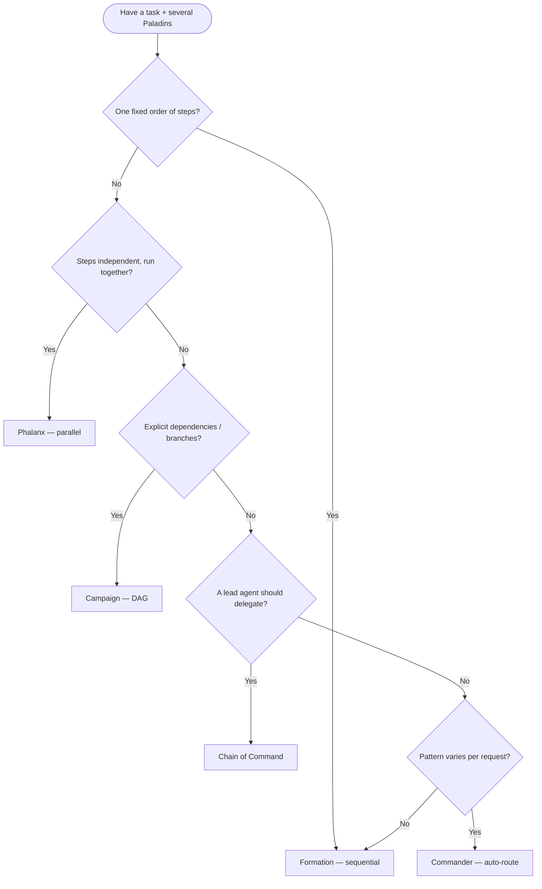

# Orchestration

The **Battalion** runtime in `crates/paladin-battalion/` coordinates multiple Paladin agents
through a family of orchestration patterns, a strategy router (**Commander**), a cron-style
**job scheduler**, and an **event/trigger** system. This guide is the comprehensive reference
for choosing a pattern and wiring it up.

For a quick pattern-by-pattern cheat sheet see [Battalion Patterns](battalion-patterns.md);
for the declarative flow language see [Maneuver Flow DSL](maneuver-flow-dsl.md); for how agents
and workflows call each other see the [Agent ↔ Orchestrator Bridge](agent-orchestrator-bridge.md).

> Every code example targets the current **v0.4.3** workspace. Examples are marked
> `rust,ignore` because they assume Paladins built elsewhere (see
> [Paladin Agents](paladin-agents.md)); the API forms are verified against
> `crates/paladin-battalion/` and `crates/paladin-ports/`.

---

## Table of Contents

1. [Workflow Patterns Overview](#workflow-patterns-overview)
2. [Formation — Sequential](#formation--sequential)
3. [Phalanx — Parallel](#phalanx--parallel)
4. [Campaign — Graph / DAG](#campaign--graph--dag)
5. [Chain of Command — Hierarchical](#chain-of-command--hierarchical)
6. [Commander — Dynamic Strategy Routing](#commander--dynamic-strategy-routing)
7. [Job Scheduling](#job-scheduling)
8. [Event and Trigger System](#event-and-trigger-system)
9. [Configuration Reference](#configuration-reference)
10. [See Also](#see-also)

---

## Workflow Patterns Overview

All orchestration services depend only on `Arc<dyn PaladinPort>` (from `paladin-ports`) — they
never import an LLM provider crate directly. Pick a pattern by the *shape* of the work:

| Pattern | Service | Execution model | Use when |
|---------|---------|-----------------|----------|
| **Formation** | `FormationExecutionService` | Sequential, output N → input N+1 | Multi-step pipelines where each stage refines the previous |
| **Phalanx** | `PhalanxExecutionService` | Concurrent, same input to all | Independent analyses you want fanned out in parallel |
| **Campaign** | `CampaignExecutionService` | DAG / topological | Branching workflows with explicit dependencies |
| **Chain of Command** | `ChainOfCommandExecutionService` | Hierarchical delegation | A commander decomposing work to specialists |
| **Commander** | `Commander` / `CommanderBuilder` | Auto-routes to a pattern | The right pattern varies per request |

> Conclave (mixture-of-experts), Council (turn-taking discussion), and Grove (semantic routing)
> are additional patterns documented in [Battalion Patterns](battalion-patterns.md). The
> declarative **Maneuver** flow DSL has its own guide: [Maneuver Flow DSL](maneuver-flow-dsl.md).

### Decision Flowchart



---

## Formation — Sequential

**Source:** `crates/paladin-battalion/src/formation_service.rs`

Each Paladin's output becomes the next Paladin's input. Ideal for refinement pipelines
(extract → analyze → write). If a stage fails, the configured `ErrorStrategy` decides whether
the chain short-circuits (`FailFast`, the default) or continues.

```rust,ignore
use paladin_battalion::formation_service::FormationExecutionService;
use paladin_core::platform::container::battalion::formation::Formation;
use paladin_core::platform::container::battalion::{BattalionConfig, ErrorStrategy};

// `extractor`, `analyzer`, `writer` are Paladins built with PaladinBuilder.
let config = BattalionConfig {
    error_strategy: ErrorStrategy::FailFast, // first failure aborts the chain
    ..Default::default()
};
let formation = Formation::new(vec![extractor, analyzer, writer], config)?;

let service = FormationExecutionService::new(paladin_port);
let result = service.execute(&formation, "Raw Q3 earnings data...").await?;

println!("Final output: {}", result.output);
```

**Error handling / short-circuit:** with `ErrorStrategy::FailFast` the first failing stage stops
the Formation and returns the error. With `ContinueOnError`, a failed stage is skipped and its
input is passed through to the next stage. Keep chains short (≤5) for latency-sensitive paths —
each stage is one sequential LLM round-trip.

---

## Phalanx — Parallel

**Source:** `crates/paladin-battalion/src/phalanx_service.rs`

Every Paladin receives the **same** input and runs concurrently on `tokio` tasks. Results are
combined according to an `AggregationStrategy`. Concurrency is bounded by a semaphore configured
via `max_concurrent_paladins` so you don't exceed LLM rate limits.

```rust,ignore
use paladin_battalion::phalanx_service::PhalanxExecutionService;
use paladin_core::platform::container::battalion::phalanx::{AggregationStrategy, Phalanx};
use paladin_core::platform::container::battalion::BattalionConfig;

let config = BattalionConfig {
    max_concurrency: Some(4), // cap concurrent Paladins
    ..Default::default()
};
let phalanx = Phalanx::new(
    vec![security_auditor, performance_analyst, style_checker],
    AggregationStrategy::Concatenate,
    config,
)?;

let service = PhalanxExecutionService::new(paladin_port);
let result = service.execute(&phalanx, "Review this Rust module...").await?;
```

`AggregationStrategy` variants: `Concatenate` (join all outputs), `FirstSuccess` (first to
finish wins), `Majority` (consensus), and `Custom`.

---

## Campaign — Graph / DAG

**Source:** `crates/paladin-battalion/src/campaign_service.rs`

Paladins are arranged in a directed acyclic graph. The service topologically sorts the graph so
every upstream node completes before its downstream nodes start; independent branches run
concurrently. `Campaign::build()` rejects cycles.

```rust,ignore
use paladin_battalion::campaign_service::CampaignExecutionService;
use paladin_core::platform::container::battalion::campaign::Campaign;

let campaign = Campaign::builder()
    .add_node("ingest", ingest_paladin)
    .add_node("analyze", analyze_paladin)
    .add_node("report", report_paladin)
    .add_edge("ingest", "analyze")   // analyze depends on ingest
    .add_edge("analyze", "report")   // report depends on analyze
    .config(config)
    .build()?;                        // returns an error if the graph has a cycle

let service = CampaignExecutionService::new(paladin_port);
let result = service.execute(&campaign, "Start").await?;
```

For conditional branching, add multiple downstream edges from a node; the service executes each
reachable branch in dependency order and aggregates the leaf outputs.

---

## Chain of Command — Hierarchical

**Source:** `crates/paladin-battalion/src/chain_of_command_service.rs`

A **commander** Paladin decomposes the task, routes sub-tasks to specialist (subordinate)
Paladins, and synthesizes their outputs into a final answer.

```rust,ignore
use paladin_battalion::chain_of_command_service::ChainOfCommandExecutionService;
use paladin_core::platform::container::battalion::chain_of_command::ChainOfCommand;

let chain = ChainOfCommand::new(
    commander_paladin,                              // supervisor
    vec![backend_dev, frontend_dev, qa_engineer],   // subordinates
    config,
)?;

let service = ChainOfCommandExecutionService::new(paladin_port);
let result = service.execute(&chain, "Build a login feature").await?;
```

Give each subordinate a distinct `agent_description` so the commander can route accurately.

---

## Commander — Dynamic Strategy Routing

**Source:** `crates/paladin-battalion/src/commander.rs`

The Commander is a single entry-point that **selects a pattern automatically** (Auto mode) based
on the input text and the number/capabilities of the Paladins, or runs an **explicit** strategy
you name. It also collects rich telemetry and can export execution metadata to JSON.

### Auto mode

```rust,ignore
use paladin_battalion::commander::CommanderBuilder;
use paladin_core::platform::container::battalion::BattalionStrategy;
use std::sync::Arc;

#[tokio::main]
async fn main() -> Result<(), Box<dyn std::error::Error>> {
    let paladin_port = Arc::new(/* your PaladinPort implementation */);

    let commander = CommanderBuilder::new(paladin_port)
        .strategy(BattalionStrategy::Auto)
        .paladins(vec![analyzer, processor, synthesizer])
        .build()?;

    let result = commander.execute("Analyze and summarize this report").await?;

    println!("Strategy selected: {:?}", result.strategy_used);
    if let Some(reason) = &result.strategy_selection_reasoning {
        println!("Reasoning: {reason}");
    }
    Ok(())
}
```

### Explicit strategy

```rust,ignore
let commander = CommanderBuilder::new(paladin_port)
    .strategy(BattalionStrategy::Formation) // force a specific pattern
    .paladins(pipeline_paladins)
    .build()?;
let result = commander.execute(input).await?;
```

### Auto-mode heuristics (first match wins)

| Priority | Strategy | Trigger keywords | Min Paladins |
|----------|----------|------------------|--------------|
| 1 | **Conclave** | synthesize, compare, perspectives, consensus, aggregate | 3+ |
| 2 | **Council** | discuss, debate, deliberate, brainstorm, dialogue | 2+ |
| 3 | **Grove** | route, best agent, expertise, most qualified | 2+ |
| 4 | **Campaign** | workflow, graph, conditional, depends on, multi-stage | any |
| 5 | **Formation** | sequential, pipeline, chain, step by step, in order | any |
| 6 | **Phalanx** | parallel, concurrent, simultaneously, in parallel | any |
| 7 | **ChainOfCommand** | delegate, hierarchy, specialist, coordinator | any |
| 8 | **Formation** | fallback — no keywords matched | any |

`Maneuver` is **explicit-only** and is never chosen by Auto mode. Strategy selection typically
adds ~0–5 ms of overhead; the decision is reported in `result.strategy_selection_reasoning`.

### Metadata export

Point the Commander at a directory and it writes one JSON file per execution
(`{strategy}_{timestamp}_{uuid}.json`) for audit, cost, and performance analysis.

```rust,ignore
use paladin_core::platform::container::battalion::BattalionConfig;
use std::path::PathBuf;

let config = BattalionConfig::new("audited_battalion")
    .with_metadata_dir(PathBuf::from("./battalion_metadata"));

let commander = CommanderBuilder::new(paladin_port)
    .strategy(BattalionStrategy::Auto)
    .paladins(paladins)
    .config(config)
    .build()?;

let result = commander.execute(input).await?;
// Metadata written to ./battalion_metadata/{strategy}_{timestamp}_{uuid}.json
```

Each file records `battalion_id`, `strategy_used`, `duration_ms`, `total_tokens`,
per-Paladin `paladin_results` (output, `execution_time_ms`, `token_count`, `stop_reason`),
`per_paladin_times`, `per_paladin_tokens`, and `strategy_selection_reasoning`.

---

## Job Scheduling

**Source:** `crates/paladin-ports/src/output/scheduler_port.rs` and `queue_port.rs`

The scheduler runs jobs on a **6-field cron** schedule; the queue ports manage asynchronous
work items. A Redis-backed implementation is gated behind the root `redis-queue` feature.

> **Prerequisites:** the Redis-backed queue requires the `redis-queue` feature and a running
> Redis instance. Run `make dev` to start it (alongside MinIO, MySQL, Qdrant).

### Scheduling a recurring job

`JobSpec` carries a human label, a cron expression, and arbitrary metadata. `SchedulerPort`
returns a `JobId` you can use to query status or cancel.

```rust,ignore
use paladin_ports::output::scheduler_port::{JobSpec, JobStatus, SchedulerPort};
use std::sync::Arc;

#[tokio::main]
async fn main() -> Result<(), Box<dyn std::error::Error>> {
    let scheduler: Arc<dyn SchedulerPort> = Arc::new(/* adapter */);
    scheduler.start().await?;

    // 6-field cron: sec min hour day month weekday
    let spec = JobSpec::new("daily-digest", "0 0 9 * * *")        // every day at 09:00:00
        .with_metadata("workflow", "news-digest");

    let job_id = scheduler.schedule_job(spec).await?;

    let status: JobStatus = scheduler.get_job_status(&job_id).await?;
    println!("job {job_id:?} is {status:?}");

    // Later: scheduler.cancel_job(&job_id).await?;
    Ok(())
}
```

`JobStatus` lifecycle: `Scheduled → Running → Completed` (or `Failed { .. }` / `Cancelled`).
`JobInfo` (from `get_job_info`) adds `created_at`, `last_run`, `next_run`, `run_count`, and
`failure_count`.

### Queue management, retry, and timeouts

The `FullQueuePort` trait composes enqueue/dequeue, batch, priority, and management operations
(`pause_queue`, `resume_queue`, `retry_item`, `purge_failed`, `get_queue_stats`). Retry and
timeout behavior for battalion execution is controlled by the `battalion.retry` and
`battalion.default_timeout_seconds` configuration (see [Configuration Reference](#configuration-reference)).

```rust,ignore
use paladin_ports::output::queue_port::{FullQueuePort, QueueStats};

let stats: QueueStats = queue.get_queue_stats("news-digest").await?;
println!("pending: {}, in-flight: {}", stats.pending, stats.in_flight);

// Retry a failed item or purge the dead-letter set
queue.retry_item("news-digest", item_id).await?;
let purged = queue.purge_failed("news-digest").await?;
```

---

## Event and Trigger System

**Source:** `crates/paladin-core/src/platform/container/trigger.rs`

A **Trigger** binds an incoming event to an action when a `TriggerCondition` matches. Events are
matched by `event_type_pattern`, optional `source_pattern`, payload conditions, minimum priority,
and optional `TimeCondition` windows (active hours/days and a cooldown).

### Defining a trigger condition

```rust,ignore
use paladin_core::platform::container::trigger::{
    TriggerCondition, TriggerConfig, TimeCondition,
};
use paladin_core::platform::container::message::MessagePriority;

let condition = TriggerCondition {
    event_type_pattern: "critical_finding".to_string(),
    source_pattern: Some("security-*".to_string()),
    payload_conditions: vec![],
    min_priority: Some(MessagePriority::High),
    time_conditions: Some(TimeCondition {
        active_hours: Some((9, 17)),       // only 09:00–17:00
        active_days: Some(vec![1, 2, 3, 4, 5]), // Mon–Fri
        cooldown_seconds: Some(300),       // at most once per 5 min
    }),
};

let config = TriggerConfig {
    max_retries: 3,
    timeout_seconds: 60,
    preserve_after_completion: false,
    ttl_seconds: 3600,
    processing_priority: MessagePriority::High,
};
```

### Firing an event

Agents and adapters fire events through the orchestrator bridge. `fire_event` returns an
`EventDispatchResult` reporting how many triggers matched and their IDs.

```rust,ignore
use paladin_ports::output::orchestrator_port::{FireEventRequest, OrchestratorPort};

let result = orchestrator
    .fire_event(FireEventRequest {
        event_type: "critical_finding".to_string(),
        payload: serde_json::json!({ "severity": "high", "cve": "CVE-2025-0001" }),
        source: "security-scanner".to_string(),
    })
    .await?;

println!("{} trigger(s) fired: {:?}", result.triggered_count, result.trigger_ids);
```

A matched trigger initiates the bound workflow (e.g. scheduling a job or queuing a Paladin run).
See the [Agent ↔ Orchestrator Bridge](agent-orchestrator-bridge.md) for end-to-end recipes that
combine events, triggers, and agent execution.

---

## Configuration Reference

All battalion behavior is configurable through the `battalion:` section of `config.yml`:

```yaml
battalion:
  default_timeout_seconds: 300     # Per-battalion execution timeout
  error_strategy: "fail_fast"      # fail_fast | continue_on_error | retry_then_continue
  max_concurrent_paladins: 10      # Phalanx concurrency limit
  metadata_output_enabled: false   # Write execution metadata to files

  retry:                           # Used when error_strategy = retry_then_continue
    max_attempts: 3
    exponential_backoff: true
    jitter: true
    base_delay_ms: 100
    max_delay_seconds: 10
```

Environment overrides follow the `APP_BATTALION_*` convention (e.g.
`APP_BATTALION_ERROR_STRATEGY`, `APP_BATTALION_MAX_CONCURRENT_PALADINS`). See
[Configuration](../getting-started/configuration.md) for the full schema.

`BattalionResult` (returned by every service) exposes: `output: String`,
`paladin_results: Vec<PaladinResult>`, `status: BattalionStatus`, `execution_time_ms: u64`,
and `token_usage: TokenUsage`.

---

## See Also

- [Agent ↔ Orchestrator Bridge](agent-orchestrator-bridge.md) — agents triggering workflows and workflows invoking agents, with use-case recipes.
- [Battalion Patterns](battalion-patterns.md) — concise cheat sheet for all eight patterns including Conclave, Council, and Grove.
- [Maneuver Flow DSL](maneuver-flow-dsl.md) — declarative composition of multiple patterns.
- [Content Processing](content-processing.md) — feeding a content pipeline into agent analysis.
- [Crate Map](../api-reference/crate-map.md) — where `paladin-battalion` and `paladin-ports` sit in the workspace.
